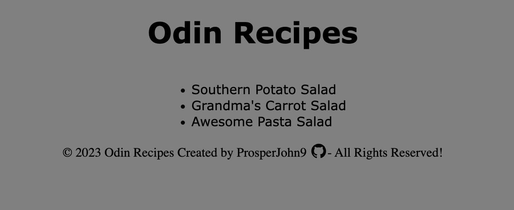

# Odin Recipes
This is a practice of all knowledge learnt from html section of the odin project. 

It is a project to build a basic recipe website

A collection of recipes for the Odin Project.

Live Demo:
https://prosperjohn9.github.io/odin-recipes

Desktop View:

# Provided Assets
Recipe Site: [recipe-site](https://www.allrecipes.com/)

# Objectives
Build a page based on the Provided Assets